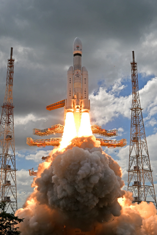
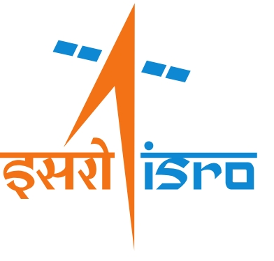

# Chandrayaan 3: India's Next Lunar Mission

India's ambitious space program is set to reach new heights with Chandrayaan 3, the third lunar exploration mission following the success of Chandrayaan 1 and Chandrayaan 2. Scheduled for launch in 2023, this mission aims to build on past achievements and further explore the lunar surface.

## Objectives

Chandrayaan 3 has several key objectives:
- **Lunar Surface Exploration:** Conduct in-depth studies of the lunar terrain, composition, and environment.
- **Technological Advancements:** Test new technologies and capabilities for future lunar and planetary missions.
- **Scientific Research:** Conduct experiments to enhance our understanding of the Moon's geology, mineralogy, and exosphere.

## Mission Components

The mission consists of:
- **Orbiter:** To orbit the Moon and facilitate communication with Earth.
- **Lander:** Intended to make a soft landing on the lunar surface.
- **Rover:** To explore the lunar surface, equipped with scientific instruments for data collection.

## Challenges and Innovations

Chandrayaan 3 faces challenges such as [mention challenges], which have led to innovations like [mention innovations]. These advancements highlight India's growing expertise in space exploration.

## Conclusion

Chandrayaan 3 represents a significant milestone in India's space exploration journey, promising to expand our knowledge of the Moon and pave the way for future missions. Stay tuned for updates as India prepares for another historic venture into space.

For more information, visit **[ISRO OFFICIAL WEBSITE ](https://www.isro.gov.in)**

